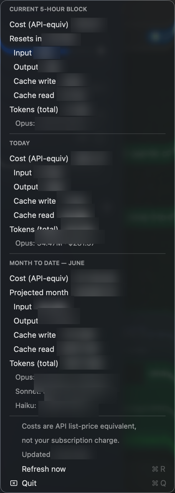

# Claude Usage Bar

[](LICENSE)


Native macOS menu-bar app that tracks Claude Code usage by parsing
`~/.claude/projects/**/*.jsonl` directly. No Node, no external services.

<p align="center">
  
  <br>
  <em>The dropdown — current 5-hour block, today, and month-to-date, each split by token type and model. (Numbers blurred here.)</em>
</p>

Shows:
- **Current 5-hour block** — token count, API-equivalent cost, and time until reset.
  Blocks follow the same rolling 5-hour window logic as `ccusage` (first activity
  floored to the hour; a new block starts after a 5h gap or once 5h elapses).
- **Today** — token count and cost since local midnight.
- Per-model breakdown (Opus / Sonnet / Haiku) in the dropdown.

Cost is the **API-equivalent** figure (token counts × public per-model pricing,
including the 5m/1h cache-write and cache-read tiers). On a subscription you don't
pay this — it's the same reference number `ccusage` reports.

## Build & install

```bash
./install.sh        # builds, copies to ~/Applications, starts at login
```

Or just build and run once:

```bash
./build.sh
open ClaudeUsageBar.app
```

Debug the numbers without the GUI:

```bash
./ClaudeUsageBar.app/Contents/MacOS/ClaudeUsageBar --once
```

Run the unit tests:

```bash
./build.sh test
```

## Layout

- `UsageCore.swift` — pure logic (pricing, JSONL parsing, dedup, 5h-block /
  today / month aggregation, projection, formatting). No AppKit, no globals
  state. This is what the tests cover.
- `main.swift` — the menu-bar app (`AppDelegate`, rendering, 5s refresh) and the
  `--once` debug entry point.
- `Tests.swift` — `@main` test runner over `UsageCore.swift` (plain assertions,
  no XCTest/SPM).

Dedup is global by `message.id|requestId` (matching ccusage), so the same
assistant message replayed across resumed/compacted/sub-agent transcripts is
only counted once.

## Notes

- First scan after launch takes ~20s (parses this month's transcripts on a
  background thread; the title shows `✦ …` until ready). Subsequent refreshes only
  re-read files whose mtime changed, so they're cheap. **Auto-refreshes every 5s**
  (live). The menu won't be swapped out from under you while it's open.
- Reported windows: current 5-hour block, today, and month-to-date — each with an
  input / output / cache-write / cache-read split plus a per-model breakdown, and a
  linear projected-month API-equivalent cost.
- Menu-bar title shows the active block cost (`✦ $4.30`); when idle it shows
  today's cost with a `·d` suffix.

## Notched MacBooks: if you don't see the icon

On 14"/16" MacBook Pros the menu bar's right side can fill up. macOS then silently
**hides** new menu-bar extras (it parks them in the dead zone behind the notch and
never draws them) — the app is still running and working, just not visible.

To make room:
- Hold **⌘** and drag an existing menu-bar icon off the bar to remove it, freeing a slot.
- Or install a menu-bar manager like **Ice** (free, open source) or Bartender, which
  reclaim notch space and let you reorder/show hidden items.

You can confirm it's running and reading correct numbers even while hidden:

```bash
osascript -e 'tell application "System Events" to tell process "ClaudeUsageBar" \
  to get title of menu bar item 1 of menu bar 1'
```

## Uninstall

```bash
launchctl unload ~/Library/LaunchAgents/com.ellerywee.claudeusagebar.plist
rm ~/Library/LaunchAgents/com.ellerywee.claudeusagebar.plist
killall ClaudeUsageBar
rm -rf ~/Applications/ClaudeUsageBar.app
```

## License

[MIT](LICENSE) © Ellery Wee
